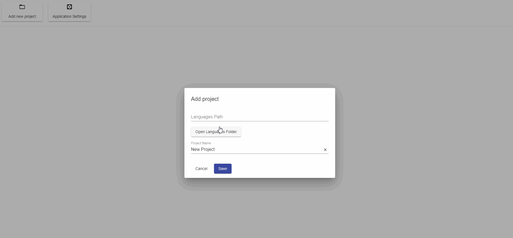

# NGX-TRANSLATE-EDITOR

> Simple GUI for CRUD translate keys of `ngx-translate`, which included `ngx-translate-lint`



## Table of Contents

- [Usage](#Usage)
- [Contribute](#Contribute)

## Installation
```bash
git clone https://github.com/svoboda-rabstvo/ngx-translate-editor.git
cd ngx-translate-editor
npm install --legacy-peer-deps

npm run electron:windows 
or
npm run electron:mac
or
npm run electron:linux
```

Then go to the `release` folder and open the app. 

## Contribute

You may contribute in several ways like requesting new features, adding tests, fixing bugs, improving documentation or examples

